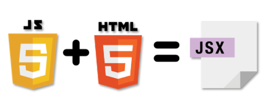
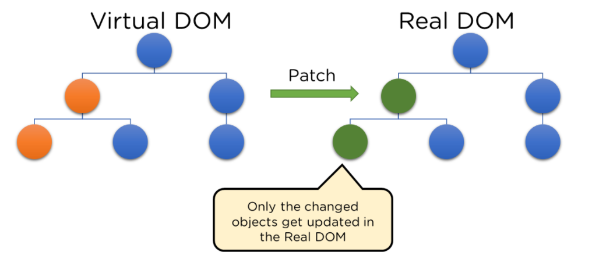
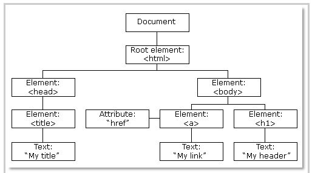
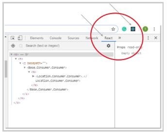
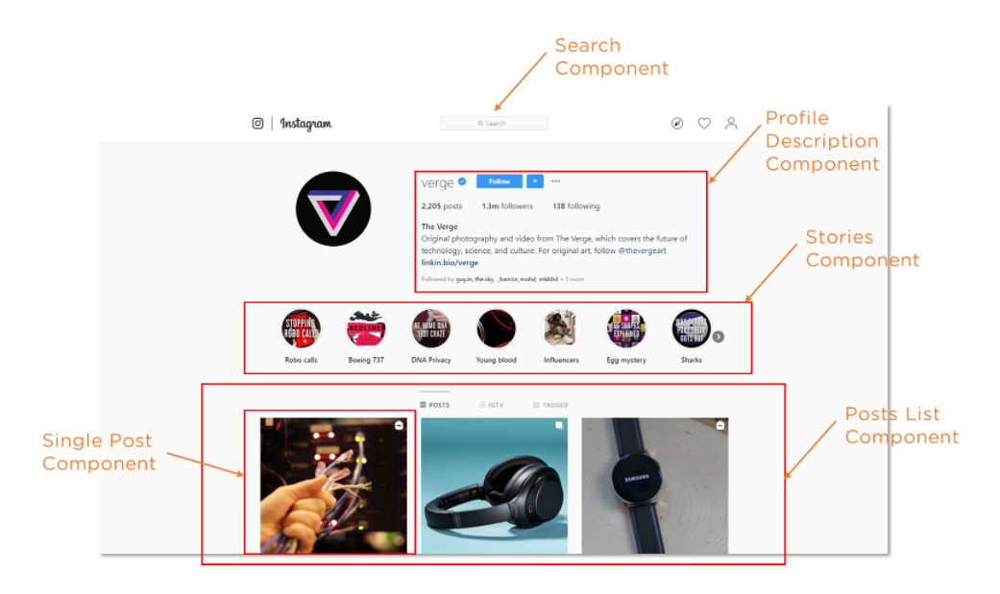
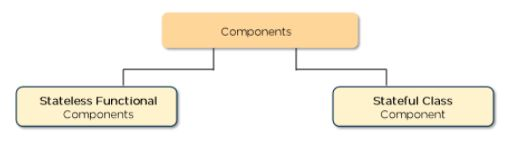

<p align="center">
  
</p>

# ReactJS কি?

ReactJS হল একটি ওপেন সোর্স জাভাস্ক্রিপ্ট লাইব্রেরি যা ইউজার ইন্টারফেসগুলিকে ঘোষণামূলক এবং দক্ষ উপায়ে তৈরি করতে ব্যবহৃত হয়। এটি একটি কম্পোনেন্ট-ভিত্তিক ফ্রন্ট-এন্ড লাইব্রেরি যা শুধুমাত্র মডেল ভিউ কন্ট্রোলার (MVC) আর্কিটেকচারের ভিউ লেয়ারের জন্য দায়ী। প্রতিক্রিয়া মডুলার ব্যবহারকারী ইন্টারফেস তৈরি করতে ব্যবহৃত হয় এবং গতিশীল ডেটা প্রদর্শন করে এমন পুনঃব্যবহারযোগ্য UI উপাদানগুলির বিকাশের প্রচার করে।

# ReactJS এর ​​ধারণা

ধরা যাক আপনার এক বন্ধু ফেসবুকে একটি ছবি পোস্ট করেছে। আপনি যদি ছবিটি পছন্দ করেন এবং তারপরে আপনি মন্তব্যগুলিও পরীক্ষা করতে শুরু করেন। এখন আপনি মন্তব্যগুলি ব্রাউজ করার সাথে সাথে আপনি দেখতে পাচ্ছেন যে পৃষ্ঠাটি পুনরায় লোড না করেও আপনি ছবিটি পছন্দ করার পর থেকে লাইকের সংখ্যা 100 বেড়েছে৷ গণনায় এই জাদুকরী পরিবর্তন ReactJS এর ​​কারণে।

দ্রষ্টব্য: ReactJS কোন ফ্রেমওয়ার্ক নয়। এটি শুধুমাত্র একটি লাইব্রেরি যা ফেসবুক দ্বারা তৈরি করা হয়েছে কিছু সমস্যার সমাধান করার জন্য যা আমরা আগে সম্মুখীন হয়েছিলাম। ReactJS এর বৈশিষ্ট্য সম্পর্কে আরও পরবর্তীতে বিস্তারিত আলোচনা করা হয়েছে|

# কেন ReactJS?

রিঅ্যাক্টের জনপ্রিয়তা আজকে অন্য সব ফ্রন্ট-এন্ড ডেভেলপমেন্ট ফ্রেমওয়ার্ককে ছাড়িয়ে গেছে। কারণ:

`Easy creation of dynamic applications(সহজেই ডায়নামিক এপ্লিকেশন তৈরি করা যাই):` রিঅ্যাক্টজেএস ডায়নামিক ওয়েব অ্যাপ্লিকেশন তৈরি করা সহজ করে কারণ এতে কম কোডিং প্রয়োজন এবং জাভাস্ক্রিপ্টের বিপরীতে আরও কার্যকারিতা অফার করে, যেখানে কোডিং প্রায়শই খুব দ্রুত জটিল হয়ে যায়।

`Improved performance(উন্নত কর্মক্ষমতা):` ReactJS ভার্চুয়াল DOM ব্যবহার করে, যার ফলে দ্রুত ওয়েব অ্যাপ্লিকেশন তৈরি হয়। ভার্চুয়াল DOM উপাদানগুলির পূর্ববর্তী অবস্থার সাথে তুলনা করে এবং প্রচলিত ওয়েব অ্যাপ্লিকেশনগুলির মতো সমস্ত উপাদানগুলিকে আবার আপডেট করার পরিবর্তে শুধুমাত্র বাস্তব DOM-এ পরিবর্তন করা আইটেমগুলিকে আপডেট করে৷

`Reusable components(পুনর্ব্যবহারযোগ্য কম্পনেন্টস):` Components হল যেকোনো Reactjs অ্যাপ্লিকেশনের বিল্ডিং ব্লক, এবং একটি একক অ্যাপ সাধারণত একাধিক উপাদান নিয়ে গঠিত। এই উপাদানগুলির তাদের যুক্তি এবং নিয়ন্ত্রণ রয়েছে এবং এগুলি পুরো অ্যাপ্লিকেশন জুড়ে পুনরায় ব্যবহার করা যেতে পারে, যা নাটকীয়ভাবে অ্যাপ্লিকেশনের বিকাশের সময়কে হ্রাস করে।

`Unidirectional data flow(একমুখী তথ্য প্রবাহ:):` React একটি একমুখী ডেটা প্রবাহ অনুসরণ করে। এর অর্থ হল একটি React অ্যাপ ডিজাইন করার সময়, বিকাশকারীরা প্রায়শই পিতামাতার উপাদানগুলির মধ্যে শিশু উপাদানগুলি নেস্ট করে। যেহেতু ডেটা একটি একক দিকে প্রবাহিত হয়, তাই ত্রুটিগুলি ডিবাগ করা সহজ হয়ে যায় এবং প্রশ্নে থাকা মুহূর্তে একটি অ্যাপ্লিকেশনে কোথায় সমস্যা হয় তা জানা।

`Dedicated tools for easy debugging(সহজ ডিবাগিংয়ের জন্য ডেডিকেটেড টুলস):` ফেসবুক একটি ক্রোম এক্সটেনশন প্রকাশ করেছে যা React অ্যাপ্লিকেশনগুলিকে ডিবাগ করতে ব্যবহার করা যেতে পারে। এটি React ওয়েব অ্যাপ্লিকেশনগুলিকে ডিবাগ করার প্রক্রিয়াটিকে দ্রুত এবং সহজ করে তোলে৷

উপরোক্ত কারণগুলি React লাইব্রেরির জনপ্রিয়তা এবং কেন এটি একটি বৃহৎ সংখ্যক সংস্থা এবং ব্যবসার দ্বারা গৃহীত হচ্ছে তা সমর্থন করে।

# কিভাবে ReactJS কাজ করে?

React ব্রাউজারের DOM আপডেট করতে মেমরিতে একটি ভার্চুয়াল DOM তৈরি করে। ভার্চুয়াল DOM ব্রাউজারের DOM আপডেট করার সবচেয়ে কার্যকর উপায় খুঁজে বের করার চেষ্টা করবে।

<p align="center">
  
</p>

# রিঅ্যাক্টজেএস প্রপস

ReactJS ডেটা প্রবাহ এবং ম্যানিপুলেশনের জন্য একটি স্বতন্ত্র পদ্ধতি অনুসরণ করে যা অনেকগুলি ধারণা (প্রপস, স্টেট, ইত্যাদি) বোঝা কঠিন করে তুলতে পারে। এই ReactJS টিউটোরিয়ালটি আপনাকে ReactJS-এর সবচেয়ে গুরুত্বপূর্ণ ধারণাগুলির মধ্যে একটি React Props বুঝতে সাহায্য করবে। "প্রপস" শব্দটি "বৈশিষ্ট্য" এর জন্য দাঁড়ায় এবং এটি একটি উপাদান থেকে অন্য উপাদানে ডেটা প্রেরণ করতে ব্যবহৃত হয়।

# রিঅ্যাক্টজেএস স্টেট

ReactJS State হল ReactJS এর ​​আরেকটি গুরুত্বপূর্ণ ধারণা। রিঅ্যাক্ট স্টেট একটি উপাদানের জন্য ডেটা ধারণ করে। এই উপাদানটি, ঘুরে, স্টেট মধ্যে থাকা ডেটা আউটপুটে ফেরত দেয়। একটি উপাদানের "স্টেট" সময়ের সাথে পরিবর্তিত হতে পারে। যখনই এটি ঘটে, উপাদানটি পুনরায় রেন্ডার হয়।

# JSX কি?

<p align="center">
  
</p>

JSX (জাভাস্ক্রিপ্ট এক্সটেনশন) হল একটি রিঅ্যাক্ট এক্সটেনশন যা আপনাকে HTML-এর মতো জাভাস্ক্রিপ্ট কোড লিখতে দেয়। অন্য কথায়, JSX হল একটি React-নির্দিষ্ট HTML-এর মতো সিনট্যাক্স যা ECMAScript প্রসারিত করে যাতে HTML-এর মতো সিনট্যাক্স জাভাস্ক্রিপ্ট/রিঅ্যাক্ট কোডের সাথে সহাবস্থান করতে পারে।

# ভার্চুয়াল ডকুমেন্ট অবজেক্ট মডেল (DOM)

<p align="center">
  
</p>

ভার্চুয়াল DOM হল রিঅ্যাক্ট-এর রিয়েল DOM-এর লাইটওয়েট সংস্করণ। বাস্তব DOM ম্যানিপুলেশন ভার্চুয়াল DOM ম্যানিপুলেশনের তুলনায় যথেষ্ট ধীর। যখন একটি বস্তুর অবস্থা পরিবর্তিত হয়, ভার্চুয়াল DOM প্রকৃত DOM-এ সমস্ত বস্তুর পরিবর্তে শুধুমাত্র সেই বস্তুটিকে আপডেট করে।

- ডকুমেন্ট অবজেক্ট মডেল (DOM) কি?

<p align="center">
  
</p>

<p align="center">
  চিত্র: একটি ওয়েবপেজের DOM
</p>

DOM (ডকুমেন্ট অবজেক্ট মডেল) একটি XML বা এইচটিএমএল ডকুমেন্টকে একটি ট্রি স্ট্রাকচার হিসাবে বিবেচনা করে যেখানে প্রতিটি নোড নথির একটি অংশের প্রতিনিধিত্বকারী একটি বস্তু।

- কিভাবে ভার্চুয়াল DOM এবং React DOM একে অপরের সাথে যোগাযোগ করে?

যখন একটি React অ্যাপ্লিকেশনে একটি বস্তুর অবস্থা পরিবর্তিত হয়, VDOM আপডেট হয়। এটি তার পূর্ববর্তী অবস্থার তুলনা করে এবং তারপরে সমস্ত অবজেক্ট আপডেট করার পরিবর্তে প্রকৃত DOM-এ শুধুমাত্র সেই বস্তুগুলিকে আপডেট করে। এটি জিনিসগুলিকে দ্রুত গতিতে নিয়ে যায়, বিশেষ করে যখন অন্যান্য ফ্রন্ট-এন্ড প্রযুক্তির সাথে তুলনা করা হয় যেগুলি ওয়েব অ্যাপ্লিকেশনে শুধুমাত্র একটি বস্তু পরিবর্তন করলেও প্রতিটি অবজেক্ট আপডেট করতে হয়।

# আর্কিটেকচার

একটি মডেল ভিউ কন্ট্রোলার (MVC) আর্কিটেকচারে, প্রতিক্রিয়া হল অ্যাপটি কেমন দেখায় এবং কেমন লাগে তার জন্য দায়ী 'ভিউ'।

MVC হল একটি আর্কিটেকচারাল প্যাটার্ন যা অ্যাপ্লিকেশন লেয়ারটিকে মডেল, ভিউ এবং কন্ট্রোলারে বিভক্ত করে। মডেলটি সমস্ত ডেটা-সম্পর্কিত যুক্তির সাথে সম্পর্কিত; ভিউটি অ্যাপ্লিকেশনের UI লজিকের জন্য ব্যবহৃত হয় এবং নিয়ামক হল মডেল এবং ভিউ-এর মধ্যে একটি ইন্টারফেস।

# ডেটা বাইন্ডিং

যেহেতু React একমুখী ডেটা বাইন্ডিং নিয়োগ করে, তাই সমস্ত ক্রিয়াকলাপ মডুলার এবং দ্রুত থাকে। তদুপরি, একমুখী ডেটা প্রবাহের অর্থ হল একটি React প্রকল্প তৈরি করার সময় পিতামাতার উপাদানগুলির মধ্যে শিশু উপাদানগুলি নেস্ট করা সাধারণ।

<p align="center">
  
</p>

<p align="center">
  চিত্র: একমুখী ডেটা বাইন্ডিং
</p>

# ডিবাগিং

যেহেতু একটি বিস্তৃত বিকাশকারী সম্প্রদায় বিদ্যমান, React অ্যাপ্লিকেশনগুলি সহজবোধ্য এবং পরীক্ষা করা সহজ। Facebook একটি ব্রাউজার এক্সটেনশন প্রদান করে যা React ডিবাগিংকে সহজ করে এবং ত্বরান্বিত করে।

<p align="center">
  
</p>

<p align="center">
  চিত্র: React এক্সটেনশন
</p>

এই এক্সটেনশনটি, উদাহরণস্বরূপ, Chrome ওয়েব ব্রাউজারের মধ্যে বিকাশকারী সরঞ্জাম বিকল্পে একটি React ট্যাব যোগ করে। ট্যাবটি সরাসরি React উপাদানগুলি পরিদর্শন করা সহজ করে তোলে।

এখন যেহেতু আপনি React এর মূল বৈশিষ্ট্যগুলি জানেন, আসুন React এর স্তম্ভগুলি বোঝার দিকে এগিয়ে যাই।

# ReactJS উপাদান

ReactJS কম্পোনেন্ট হল ReactJS-এর সাহায্যে তৈরি যেকোনো অ্যাপ্লিকেশনের বিল্ডিং ব্লক। এটি ব্যবহারকারীর ইন্টারফেসকে স্বাধীন অংশে বিভক্ত করে, যার প্রতিটি আলাদাভাবে প্রক্রিয়া করা যেতে পারে। ReactJS উপাদানগুলি আপনাকে ব্যবহারকারী ইন্টারফেস উপাদানগুলিকে পুনরায় ব্যবহার করার অনুমতি দেয়, যা ReactJS কে এত জনপ্রিয় করে তুলেছে।

<p align="center">
  
</p>

React ব্যবহারকারী ইন্টারফেসকে অসংখ্য উপাদানে বিভক্ত করে, ডিবাগিংকে আরও অ্যাক্সেসযোগ্য করে তোলে এবং প্রতিটি উপাদানের নিজস্ব বৈশিষ্ট্য এবং ফাংশন রয়েছে।

এখানে উপাদানগুলির কিছু বৈশিষ্ট্য রয়েছে -

- Re-usability (পুনরায় ব্যবহারযোগ্যতা) :- অ্যাপ্লিকেশনের একটি এলাকায় ব্যবহৃত একটি উপাদান অন্য এলাকায় পুনরায় ব্যবহার করা যেতে পারে। এটি উন্নয়ন প্রক্রিয়া ত্বরান্বিত করতে সাহায্য করে।

- Nested Components (নেস্টেড উপাদান) :- একটি উপাদানে অন্যান্য অনেক উপাদান থাকতে পারে।

- Render method (রেন্ডার পদ্ধতি) :- ন্যূনতম আকারে, একটি উপাদানকে অবশ্যই একটি রেন্ডার পদ্ধতি সংজ্ঞায়িত করতে হবে যা নির্দিষ্ট করে যে কীভাবে উপাদানটি DOM এ রেন্ডার করে।

- Passing properties (ক্ষণস্থায়ী বৈশিষ্ট্য) :- একটি উপাদান প্রপসও পেতে পারে। এগুলি মান নির্দিষ্ট করার জন্য এর পিতামাতার দ্বারা পাস করা বৈশিষ্ট্য।

## React উপাদানের প্রকার

### React এ দুই ধরণের উপাদান রয়েছে:

<p align="center">
  
</p>

<p align="center">
  চিত্র: React উপাদান
</p>

- ফাংশনাল কম্পোনেন্টস :- এই ধরনের উপাদানগুলির নিজস্ব কোনো অবস্থা নেই এবং শুধুমাত্র একটি রেন্ডার পদ্ধতির অধিকারী। এগুলিকে stateless উপাদান হিসাবেও উল্লেখ করা হয়। তারা প্রপস (বৈশিষ্ট্য) এর মাধ্যমে অন্যান্য উপাদান থেকে তথ্য আহরণ করতে পারে।

```
const App = () => {
  return (
    <div>
      <h1>React Functional Component</h1>
    </div>
  );
};

```

- ক্লাস কম্পোনেন্টস :- এই ধরণের উপাদানগুলি তাদের অনন্য অবস্থা ধরে রাখে এবং পরিচালনা করে এবং স্ক্রিনে JSX ফেরানোর জন্য একটি পৃথক রেন্ডার পদ্ধতি রয়েছে। তাদের stateful উপাদান হিসাবেও উল্লেখ করা হয়, কারণ তারা একটি রাষ্ট্রের অধিকারী হতে পারে।

```
class App extends React.Component {
  constructor(props) {
    super(props);

    this.state = {
      value: "",
    };
  }

  onChange = (event) => {
    this.setState({ value: event.target.value });
  };

  render() {
    return (
      <div>
        <h1>React Class Component</h1>

        <input value={this.state.value} type="text" onChange={this.onChange} />

        <p>{this.state.value}</p>
      </div>
    );
  }
}

```

# ReactJS স্টেট

একটি স্টেট এমন একটি বস্তু যা কিছু সময়ের সাথে পরিবর্তিত হতে পারে এমন একটি উপাদানের জন্য দায়ীদের জন্য বৈশিষ্ট্যের মান সংরক্ষণ করে।

- ব্যবহারকারীর ক্রিয়া বা নেটওয়ার্কে পরিবর্তনের ফলে একটি স্টেট পরিবর্তন করা যেতে পারে।
- যখনই কোনো বস্তুর অবস্থা পরিবর্তিত হয় তখন React ব্রাউজারে উপাদানটিকে পুনরায় রেন্ডার করে।
- অবজেক্ট() { [নেটিভ কোড] } ফাংশন হল যেখানে স্টেট অবজেক্ট তৈরি করা হয়।
- স্টেট অবজেক্টে একাধিক বৈশিষ্ট্য সংরক্ষণ করা যেতে পারে।
- this.
- setState() স্টেট অবজেক্টের মান পরিবর্তন করতে ব্যবহৃত হয়।
- setState() ফাংশন অগভীরভাবে নতুন এবং পূর্ববর্তী state গুলিকে একত্রিত করে।

#### নিম্নলিখিত উপাদান বিবেচনা করুন, State.js

```
import React, { Component } from "react";

class State extends Component {
  constructor(props) {
    super(props);

    this.state = {
      message: "Welcome to Reatc Js",
    };
  }

  render() {
    return (
      <div className="App">
        <h3>{this.state.message}</h3>
      </div>
    );
  }
}

export default State;

```

এখানে, h3 ট্যাগ 'মেসেজ', একটি state বস্তুর মান প্রদর্শন করে।

#### আপনার প্রধান উপাদান, App.js, নিম্নলিখিত কোড বিবেচনা করুন.

```
import React from "react";

import "./App.css";

import State from "./Components/State";

class App extends React.Component {
  styles = {
    fontStyle: "bold",

    color: "teal",
  };

  render() {
    return (
      <div className="App">
        <h1 style={this.styles}> Welcome </h1>

        <State />
      </div>
    );
  }
}

export default App;

```

# Props vs. State in React

<table>
  <thead>
    <tr>
      <th>Props</th>
      <th>State</th>
    </tr>
   </thead>
   <tbody>
     <tr>
       <td>প্রপগুলি একটি উপাদানের শিশুদের ডেটা এবং ইভেন্ট হ্যান্ডলার পাঠাতে ব্যবহৃত হয়</td>
       <td>উপাদানগুলির ডেটা যা এটিকে উপস্থাপন করতে হবে তা state ভিউ সংরক্ষণ করে</td>
     </tr>
     <tr>
       <td>প্রপগুলি অপরিবর্তনীয় — সেগুলি সেট করার পরে পরিবর্তন করা যাবে না</td>
       <td>ডেটা state সংরক্ষণ করা হয়, যা সময়ের সাথে সাথে পরিবর্তিত হতে পারে</td>
     </tr>
     <tr>
       <td>কার্যকরী এবং শ্রেণী উভয় উপাদানই প্রপস ব্যবহার করে উপকৃত হতে পারে</td>
       <td>শুধুমাত্র শ্রেণী উপাদান state ব্যবহার করতে পারেন</td>
     </tr>
     <tr>
       <td>পিতামাতার উপাদান শিশুদের উপাদানগুলির জন্য প্রপস সেট করে</td>
       <td>ইভেন্ট হ্যান্ডলাররা সাধারণত state আপডেট করার জন্য দায়ী</td>
     </tr>
  </tbody>
</table>

# ReactJS এ প্রপস কি?

ReactJS একটি উপাদান-ভিত্তিক লাইব্রেরি হওয়ায়, ব্যবহারকারী ইন্টারফেস (UI) ছোট, পুনঃব্যবহারযোগ্য টুকরোগুলিতে বিভক্ত। এই উপাদানগুলিকে কিছু পরিস্থিতিতে একে অপরের কাছে ডেটা প্রেরণের প্রয়োজন হতে পারে এবং উপাদানগুলির মধ্যে ডেটা প্রেরণ করা হয় প্রপসের মাধ্যমে। "প্রপস" শব্দটি "প্রোপার্টিজ" এর জন্য দাঁড়ায় এবং এটি একটি উপাদান থেকে অন্য উপাদানে ডেটা প্রেরণের জন্য ব্যবহৃত হয়। React এ state এর বিপরীতে, প্রপগুলি শুধুমাত্র পঠনযোগ্য। সুতরাং, একটি পিতামাতার উপাদান থেকে আসা ডেটা শিশু উপাদান দ্বারা পরিবর্তন করা যাবে না।

## React এ প্রপস ব্যবহার করা

আমরা একটি React অ্যাপ্লিকেশনে প্রপস সম্পূর্ণরূপে বাস্তবায়নের জন্য তিনটি ধাপ অনুসরণ করি। এইগুলো:

- একটি বৈশিষ্ট্য এবং এর মান সংজ্ঞায়িত করুন
- প্রপস ব্যবহার করে শিশু উপাদান বা উপাদান এটি পাস
- প্রপস ডেটা রেন্ডার করুন

##### এখানে, অন্য একটি শিশু উপাদান সহ আমাদের একটি পিতামাতার উপাদান রয়েছে:

#### পিতা উপাদান:

```
class Parent extends Component {
  render() {
    return (
      <h1>
        the parent component
        <Child />
      </h1>
    );
  }
}

```

#### শিশু উপাদান:

```
const ChildComponent = () => {
  return <p>Child 1</p>;
};

class ParentComponent extends Component {
  render() {
    return (
      <h1>
        the parent component
        <Child />
        <Child />
        <Child />
      </h1>
    );
  }
}

```

এখানে কম্পোনেন্ট একই স্ট্রিং একাধিকবার আউটপুট করবে, কিন্তু আমরা চাইল্ড কম্পোনেন্ট কল করার সময় প্রতিটি আউটপুটে একটি ভিন্ন স্ট্রিং বরাদ্দ করতে পারি। আসুন নিম্নলিখিত পদক্ষেপগুলি ব্যবহার করে এটি করি:

### ১ম ধাপ: বৈশিষ্ট্য এবং ডেটা সংজ্ঞায়িত করা

আমরা এইভাবে কল করার সময় React উপাদানগুলিতে ডেটা বরাদ্দ করতে পারি:

```
<Child attr1={value} attr2={value}/>
```

আমাদের ক্ষেত্রে, আমরা টেক্সট হিসাবে বৈশিষ্ট্যের নাম দেব এবং এটিতে স্ট্রিং বরাদ্দ করব:

```
<Child text={“I’m the 1st child”} />
```

এখন যেহেতু আমরা ডেটা যোগ করেছি, আমাদের প্রপসের মাধ্যমে ডেটা পাস করতে হবে।

### ২য় ধাপ: প্রপস ব্যবহার করে ডেটা পাস করা

এখন "চাইল্ড 1" স্ট্রিংটি নেওয়া যাক এবং প্রপস ব্যবহার করে এটি পাস করা যাক। প্রপস পাস করা সহজ, এবং আমরা প্রপস যোগ করতে পারি যেমন আমরা একটি ফাংশনে একটি আর্গুমেন্ট পাস করি।

```
const Child = (props) => {
  return <p>Child 1</p>;
};

```

"প্রপস হল আর্গুমেন্ট যা রিঅ্যাক্ট উপাদানে পাস করা হয়।"

### চূড়ান্ত ধাপ: রেন্ডারিং প্রপস ডেটা

এখন আমাদের প্রপস রেন্ডার করতে হবে যেহেতু আমরা ইতিমধ্যেই একটি আর্গুমেন্ট হিসাবে চাইল্ড কম্পোনেন্টে এটি পাস করেছি:

```
const Child = (props) => {
  return <p>{props.text}</p>;
};

```

```
class Parent extends Component {
  render() {
    return (
      <h1>
        the parent component.
        <Child text={"Child 1"} />
        <Child text={"Child 2"} />
        <Child text={"Child 3"} />
      </h1>
    );
  }
}

```

প্রতিটি চাইল্ড কম্পোনেন্ট এখন প্রতিবার ডাকার সময় একই জিনিস প্রিন্ট করার পরিবর্তে তার প্রপ ডেটা রেন্ডার করে। এইভাবে আমরা একটি উপাদান থেকে অন্য উপাদানে প্রপস প্রেরণ করি এবং একটি প্রতিক্রিয়া অ্যাপ্লিকেশনের গতিশীলতা সক্ষম করি।

## `সারসংক্ষেপ`

- Props stand for properties
- প্রপগুলি ফাংশন আর্গুমেন্টের মতো উপাদানগুলিতে প্রেরণ করা হয়
- প্রপস শুধুমাত্র পিতামাতা থেকে সন্তানের মাধ্যমে উপাদানগুলিতে প্রেরণ করা যেতে পারে
- প্রপস ডেটা অপরিবর্তনীয় (শুধু পড়ার জন্য)